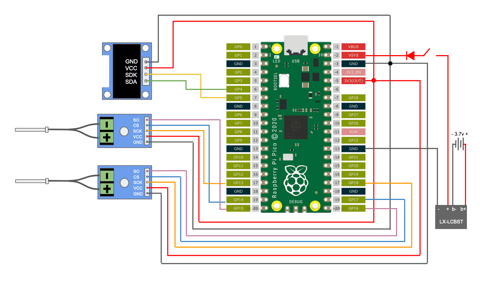
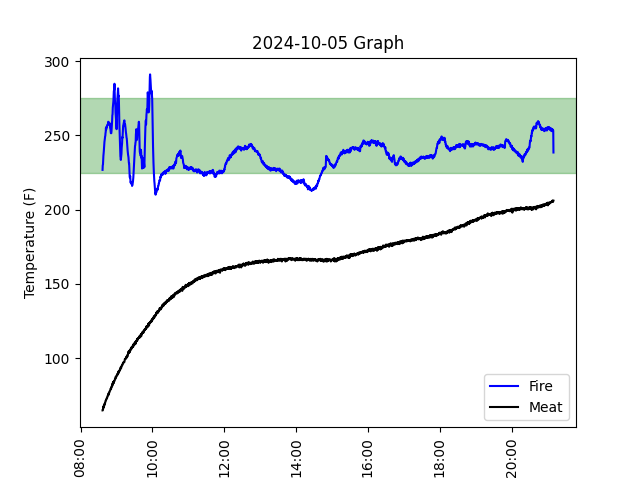

# Pi-tmaster

An open source project to make a food thermometer for barbecue, specifically smoking meat. The hardware for this project is all very low-cost and only requires basic skills to assemble. It's even possible to do this without soldering by using a breadboard. 

Video Overview:

------------------------------------------------
## 1. Hardware

### Microcontroller

The basis of the project is a Raspberry Pi Pico W. However, if you don't want the wireless capabilities, you can easily use a regular Raspberry Pi Pico. 

### Thermocouples and Converters
The thermocouple to digital converter I use is a MAX6678. This is mostly because the documented temp range is 0&deg;C to 1024&deg;C. I figured in a cooking situation, I wouldn't need temps lower than 0 and aluminum melts at 659&deg;C, where I'd have bigger concerns than meat. The MAX6678 use an SPI interface, which the Pico can talk to by specifying the pin assignments and using the MAX6675 library.

The probes that came with the original Converters had a really short probe length and I wanted something I could stick into the meat, so I purchased an additional probe which was both longer and had a pointed end. These are K-type thermocouple probes which come in a wide variety of shapes and sizes, Find one which is the appropriate length, diameter, and shape. 

### Screen
For the screen, I use a SH1106 OLED display. I chose this over the more common SSD1306 display because it's a little larger, even if the resolution is the same. The screen uses an I2C interface which the Pico can talk to by using the GyverOLED library and initializing the screen as an SH1106. 

### Power Management
Initially, I thought about throwing a smaller USB power bank in the box and just having it constantly powered through that. However, After looking into battery options, I found that the LX-LCBST lithium battery chargers were very easy to work with. All you have to do is connect the battery terminals to the correct polarity on the battery, and the output terminals to the correct polarity.

The batteries I'm using here are two 1500 mAh batteries that I had lying around, I connected them in parallel so they still give 3.7 v, but provide more amperage. There's plenty of space in the case as well, so if I wanted to increase the battery capacity I could easily swap. In the price calculation, I just treated the two as one battery, listing the price for both.

When powered on, the Pi-tmaster has a current draw of 70 milliamps. This means that a 3000 mAh battery can theoretically last for 428.57 hours. I haven't yet tested this, but I have had this last for over 16 hours. Improvements in battery life could also likely be achieved by turning the wifi off so it's just a digital thermometer, or lowering the refresh rate.

I also added a heavy-duty switch along with a diode so that it doesn't back feed from the Pico to the charger if the USB is plugged in.

### Case
I saw these cheap clear hard cases on AliExpress and thought that it would make a great enclosure of the project. Since it was waterproof (at least according to the seller), I figured it would be fun to maintain that the best I could. To do this, I used some gaskets cable glands for the probes as well as a switch which had a rubber cover over it. Besides that, I just put some dielectric grease on the gasket of the case itself. The probes are also themselves waterproof.

While I wouldn't go swimming with this, I feel pretty confident that if it gets rained on it would be fine. 

------------------------------------
## 2. Software

#### Raspberry Pi Pico W Code

The code for the Raspberry Pi Pico W is in the ``Pi-tmaster.ino`` file and is written in Arduino C++. I decided to go with this over Micropython because it was a good learning experience with both the language and using Arduino IDE. 

Having said that, this code is pretty basic. It has roughly does two things. Firstly, it collects temperature information and displays it on the screen. Secondly, it creates a WiFi network which you can connect to. By opening 192.168.1.1 on a device connected to this network, you can see the temperature information. 

I originally entertained making the thermometer connect to a home wifi network like an IoT device, but given the vulnerabilities which are often introduced with IoT devices, I decided to make it a stand-alone network. Of course, if you wanted to make it an IoT device, you could modify the code to do that. 

The calibration of the probes/MAX6675 might be off by a few degrees. This can be easily adjusted in the Arduino code by manipulating the floating point value returned by the thermocouple object's ``.readFahrenheit()`` method. I tested my probes at ambient room temp, in boiling water, and in a smoker against a reliable thermometer, and they both required a little tweaking. 

#### Monitoring Code

There are two python files, ``collect.py`` and ``graph.py``, to run from a monitoring station. 

The main code, ``collect.py``, creates a standing 'while' loop which pings the router/API (the Pico @ 192.168.1.1) and returns the current temps. It then writes each datapoint and appends it to a .txt file. Note that that appending only adds to the end of a file without reading the whole file into memory, so the time complexity for recording data is constant. 

When the while loop ends, it also calls ``graph.py``, which will read in the data that ``collect.py`` wrote to, parse it into a pd.DataFrame, and create a graph. This graph has two lines that track the meat temp and the pit temp. I also added a patch between 225&deg;F and 275&deg;F which is a pretty standard temp range for smoking meat. 

The resulting graph is also saved as a local image file. Note that ``graph.py`` can also be used independently to parse and create graphs from any data file, not only one that was just recorded. 

One parameter to pay attention to is the data collection rate. The Pico updates its on-board variables every 2 seconds. Over a 12 hour cook, that's 21,600 potential data points, far more than is really useful. I typically sample every 20 seconds, or 3 times a minute instead. This is still plenty of data at a very useful resolution. However, due to the high update rate of the Pico, if you want to look at the numbers on the screen or refresh the API, the readings are more or less instant. 

However, even with a high data-collection rate, the limitation here really isn't storage space. For a cook of over 12 hours, my data file was still 136 kb. 

---------------------------------------
## 3. Output

In the end, the resulting graph might look something like this: 

With the green patch, between 225&deg;F and 275&deg;F, it's very easy to see where my smoker temps were in the desired range. Here, my temps were very volatile while I was fighting to get the water pan in the Weber Smokey Mountain up to temp, but after the first two hours, the temps evened out a lot.

It was also very interesting to see how this brisket stalled right at 165, and held its stall for over an hour with basically no change in temperature.

---------------------------------------
## 4. Price Breakdown
I purchased almost everything from AliExpress, and here is an approximate price break down:

| Item             | Number Needed|Unit Price (USD)  |
|------------------|--------------|------------------|
| RPi Pico W       | 1            | 6.00             |        
| Case             | 1            | 7.16             |
| Switch           | 1            | 1.03             |
| Cable glands     | 2            | 0.21             |
| MAX6675          | 2            | 1.86             |
| SH1106 display   | 1            | 2.19             |
| LX-LCBST         | 1            | 0.70             |
| Perf Board       | 1            | 0.10             |
| Diode            | 1            | 0.01             |
| Pointed Probe    | 1            | 4.60             |
| LiPo battery     | 1            | 8.99             |

Total Price: $34.92

This project cost me a bit less since I already had a lot of things lying around in a parts box, such as the Pico, batteries, perf board, and diode, and you likely have some of this stuff lying around as well.

At this price point I think this a very competitive alternative to commercially available offerings. Not only do you get a thermometer which is wireless and pretty darn accurate, it's repairable, doesn't require an app, and doesn't send your data to a dubiously nefarious or unsecure server somewhere across the world. Also, it's about as repairable and moddable as it gets. If something fries or if you want to upgrade it, you can change the hardware and software however you'd like. 

Additionally, there are a number of thing you can do to cut costs as well. There are a number microcontrollers which could be substituted, such as an ESP32, another RP2040 board, or an Arduino. If you wanted a waterproof case but didn't want to get a fancy outdoor hard case, a watertight kitchen container was an option I considered. 

--------------------------------------
# 4. Possible Further Development

Possible further steps in this project would be:

### A. Have some way of using the pico to write to a storage device like a flash drive or SD card.
This would be a good way of having data even without connecting a computer, could simplify things and cut down on power consumption to extend battery life.

### B. Battery Indicator
A number of Raspberry Pi Pico projects all use the voltage to give an approximate gauge on the battery. I thought about implementing this, but since I'm using the charging board, it scrubs out a lot of the fluctuations in voltage and delivers a steady 5v. I'd be interested in changing the power delivery setup so that I can still monitor battery life. 

### C. Solar
One option I entertained is using a solar panel to charge the battery, since the power draw of the Pico is so low, even with running a wireless AP. It would also avoid having to open the box in order to charge it, which could be a cool feature. 

### D. Micropython
One of the reasons I wanted to do this project in C++ was because of the supposed performance advantages of the language compared to Micropython. However, this makes me curious if there's a concrete difference for this project if it were written in Micropython, since I'm not doing anything that's especially computation or power hungry. 

### E. Humidity Detection
I'm relatively new to smoking meat, but people who are masters at it often list humidity as a major factor in how the barbecue turns out. However, humidity sensors such as the DHT11 (a common humidity sensor for microcontrollers) seem to not do so well at high temps according to their data sheets. I would be interested in seeing if a more robust module could be added to monitor humidity as well. 

### F. Real-Time Analytics
While in use, the Pi-tmaster allows for both up-close and remote monitoring, but offers nothing in terms of real-time analytics. If I were to imagine further functionality that I might want, I think something like having a cue that can tell me when the meat is stalling or when I need to add charcoal would be interesting. I also played around with showing a real-time graph, but chose against it because doing so would add O(n) complexity, which could be increasingly burdensome over a several-hour cook since it would require reading the whole data file every time. However, is would be very cool and I think is worth exploring. 

### G. Different Wireless Protocols
One limitation of using the Pico W as an access point is that the wifi range of the Pico W is not very far, especially when walls get in the way. While it was always possible to connect the Pico to an existing home wifi network, I disliked this option because of constraints on range and security vulnerabilities. However, there are some wireless protocols which excel at applications like this, such as ESP-NOW and LoRa. These may be good alternatives that extend range, and maybe even lower power consumption. 
